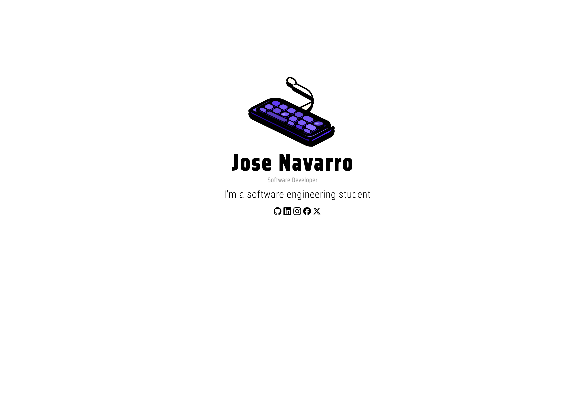

 

  

<h3 align="center"  href="https://git.io/typing-svg"></h3>

<h6 align="center">Hi 🤙! My name is Jose. and I'm a , from Colombia</h6>

<h3 align="center" href="https://git.io/typing-svg"></h3>

 

  
  
  
  
  
  
  
  
  
  
  
  
  
  
  
  
  
  
  
  
  
  
  
  
  
  
  

<h3 align="center"> Sociale Media </h3>

  
  
  

###

 

  

    
  

  

    
  

  

    
  

### Commit 👨‍💻

###
